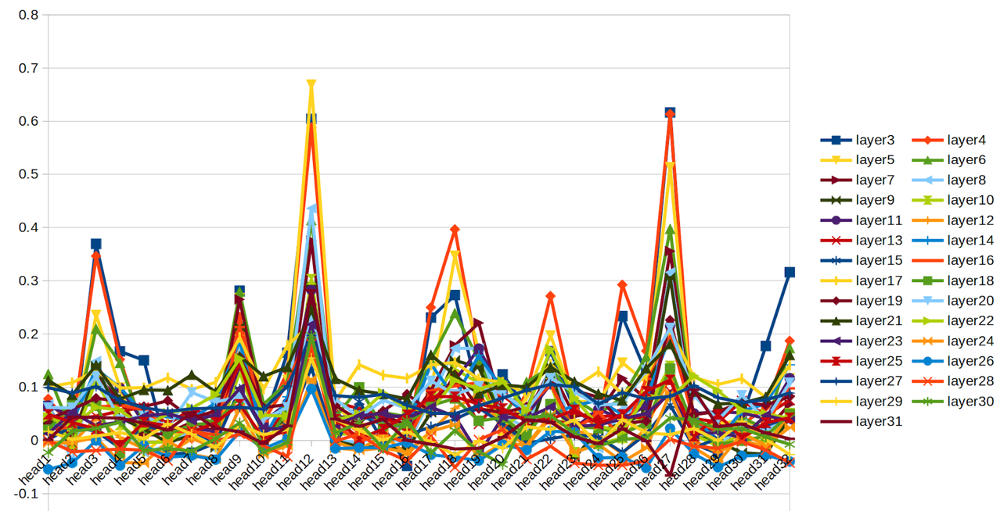

= Dynamic Elastic Multi-LoRA Model on-device Inference
Xihao Sun <sunxh2016@lzu.edu.cn>
:toc:
:icons: font
:url-quickref: https://docs.asciidoctor.org/asciidoc/latest/syntax-quick-reference/

== Problem Statement

.Common Model Sizes Used for Different Applications
|===
|Application|Model Size|Models
|Chatbotfootnote:[https://lmsys.org/blog/2023-05-25-leaderboard/]|3B-7B|	Orac-mini-3Bfootnote:[Orca: Progressive Learning from Complex
Explanation Traces of GPT-4]/FastChat-T5-3B/Vicuna-7B/MPT-7Bfootnote:[https://lmsys.org/blog/2023-05-25-leaderboard/]/Llama2-7Bfootnote:[Llama 2: Open Foundation and Fine-Tuned Chat Models]/Falcon-7B
// |Translationfootnote:[Reseh Development of Machine translation and Large Language Model]footnote:[BayLing: Bridging Cross-lingual Alignment and Instruction Following through Interactive Translation for Large Language Models]|6B-13B|ChatGLM-6B/Alpaca-7B/Vicuna-13B
|Code Generationfootnote:[https://zhuanlan.zhihu.com/p/651439303]footnote:[Large Language Models Meet NL2Code: A Survey]|13B-16B|CodeLlama-13Bfootnote:[1]/CodeT5P-16Bfootnote:[CodeT5+: Open Code Large Language Models for Code Understanding and Generation]/OctoCoder-16Bfootnote:[OctoPack: Instruction Tuning Code Large Language Models]
|High-quality Document Summarizationfootnote:[A Systematic Survey of Text Summarization: From Statistical Methods to Large Language Models]|>30B|Llama2-70Bfootnote:[Cross-lingual Multi-document Summarization Based on Chain-of-Thought]/GPT-4/PT-4footnote:[A Systematic Survey of Text Summarization: From Statistical Methods to Large Language Models]
|===

* QA：SQuADfootnote:[Squad: 100,000+ questions for machine comprehension of text], ARC easy and challenge (Clark et al., 2018)footnote:[Think you have solved question answering? try arc, the ai2 reasoning challenge]
SQuAD prompt mean length: 13
// ARC-e prompt mean length: 23
// ARC-c prompt mean length: 26

// * Translation： Workshop on Machine Translation()

* Code. We report the average pass@1 scores of our models on HumanEval (Chen et al., 2021)footnote:[Evaluating large
language models trained on code] and MBPP (Austin et al., 2021)footnote:[Program synthesis with large language
models].
HumanEval prompt mean length: 132

* Commonsense Reasoning.
// TrivialQAfootnote:[TriviaQA: A Large Scale Distantly Supervised Challenge Dataset for Reading Comprehension]
L-Evalfootnote:[L-Eval: Instituting Standardized Evaluation for Long Context Language Models]
// TrivialQA prompt mean length: 14
LEval-new summ prompt mean length: 4K+

为了统计模型在不同的数据集上的推理延迟，我们统计了数据集中prompt的长度，并采用平均长度的数据进行平均推理延迟的测评。

.Performance and Latency Comparison of Different Models
|===
|Model|SQuAD 0-shot|TTFT|TPOT|ARC-e|TTFT|TPOT|ARC-c|TTFT|TPOT|Human-Eval pass@1|TTFT|TPOT|L-Eval ROUGE-1|TTFT|TPOT
// |Orac-mini-3B||||||||||41.55||
// |FastChat-T5-3B||||||||||||
// |Vicuna-7B|sq|t|t|e|t|t|c|t|t|h|t|t|28.91||
// |MPT-7B| 59.5|||70.2|||42.6|||18.3|||7.66||
|Llama-2-7B|67.2|18.638|10.797|75.2|21.639|10.777|45.9|21.711|10.792|12.8|72.79777778|11.09222222|29.75|2093.852222|16.47333333
|Llama-2-13B|72.9|37.69|24.562|77.3|43.942|26.409|49.4|45.512|26.23|18.3|130.77|26.74|30.49|8107.264|50.576
// |Vicuna-13B|sq|t|t|e|t|t|c|t|t|h|t|t|28.59||
|Llama-2-70B|80.7|4586.691|1126.855|80.2|4089.338|1132.963|57.4|4808.393|1134.967|29.9|19766.63|1151.89|44.4312|362433.67|1255.14
|===

The experiments were run on a Quadro RTX 6000 equipped with 24GB of GDDR6 video memory, and since 24G could not accommodate the 70B model, CPU offloading of the computation had to be used, which ultimately led to a significant increase in the overall inference latency.

== Existing Works
// 切换延迟
* Multi-App-Multi-Models

In the event of the exclusive large model being customised for each task, it is necessary to load the model parameters from disk to CPU when loading to GPU each time the application is switched.
The following illustration shows the model inference latency for different sizes, considering the loading time of the model into TTFT:

.TTFT Considering the Loading Time
image::Figure/cpu-gpu-latency.png[switching-latency]

* Multi-App-Static-Model

The static model only satisfies a single inference delay or a single accuracy.

* Multi-App-Flexible-Model

ELMSfootnote:[ELMS: Elasticized Large Language Models On Mobile Devices] Using mobile phones as experimental platforms, it only supports the deployment of 3B-7B small and medium scale models, not large models. As for consumer-grade GPUs, the reasoning of 70B large models can be achieved with the help of quantisation and CPU offloading computation.

== Observations
* 不同的模型层间重要性的分布基本相同，但是子层之间的重要性存在差异

.Layer-Importance of Different Models

.Layer-Importance of Different Models

.SubLayer-Importance of Different Models

- layer-importance vs AdaSkip：仅有首尾存在重要性差距
- sublayer-importance：按照子层的重要性进行筛选

因为我们要做弹性模型推理框架，所以需要对原始模型进行弹性处理。通过对比不同模型层间的IO相似度，我们发现模型的首尾层具有较高的重要性，中间层重要性较低。并通过消融实验进行了进一步验证，跳过中间的某一层对模型的推理性能影响非常小，跳过首尾层对模型的推理性能影响非常大。

.Importance of the middle layer

.Skipping peak gradient layers of middle layers

因此我们可以选择中间层进行弹性操作，在减少推理计算的同时又能保证精度。但是随着跳过层数的增加，模型精度飞速下降，因此我们需要根据根据用户设定的SLO合理选择需要跳过的模型层数。但是无论是IO相似度还是消融实验，中间层的重要性都十分接近，无法进行更精确的选择。然而，我们发现MLP层down矩阵的梯度可以更好的区分中间层的，图5显示Squad数据集上梯度相比精度和IO相似度的变化，更能体现层间差异性。我们进行了消融实验证明了down矩阵梯度和重要性的相关性，我们分别跳过n层最大和最小梯度的层，图6展示了跳过n层最大梯度的模型困惑度快速增大，说明梯度大的层具有更高的重要性。

**Observation 1: 不同输入下，MLP层down矩阵的梯度峰值层相同**

.The gradient peak layer of the MLP layer down matrix is the same for different inputs
image::Figure/same-gradient-peak-layer.png[]

我们发现不同输入的尽管down矩阵的梯度值不同，但是具有相同的峰值下标。那就说明同一个模型面向多样的用户输入，中间层重要性的分布实际是相同的。图7所示，在3种不同的数据集上分别运行模型Orac-mini-3B、Llama-2-7B、MPT-7B、Llama-2-13B，尽管不同数据集上运行的梯度值不同，但是梯度峰值层基本保持一致。综上所述，我们可以通过一次梯度分析，实现整个推理流程的中间层选择。

// 进一步观察发现，数据集prompt的平均长度：SQuAd < Human_Eval < L-Eval，随着prompt长度的增加，梯度变化会变小。prompt长度直接影响的了预填充阶段的TTFT，所以我们可以通过prompt压缩技术，既能减少TTFT，又能增加中间层重要性的差异识别度。

**Observation 2: 中间层的Attn Head的IO Similarity峰值层相同**

.IO Similarity peak layer of Attn Head in the middle layer is the same

为了进一步细化弹性粒度，我们发现中间层的注意力头之间IO相似度的峰值分布是相同的。如图8展示了不同数据集Llama-2-7B的层间注意力头的IO相似度分布，不同层之间的峰值层相同。因此我们在接收到用户输入时，只用一层中间层的注意力层就可以计算出全部中间层的注意力重要性。

**Observation 3: 不同数据集之间的Head重要性分布是相似的**

.Attn Head Importance of Different Input in a same dataset
image::Figure/diff-head.png[]

== Challenges
1. 如何根据SLO的约束准确得选择中间层？
2. 如何根据用户输入快速得选择中间层得注意力头？
3. 如何实现不同应用之间模型参数的快速切换？

== Design
=== 1. 面向SLO的中间层选择
.Layer latency for different inputs

受内存带宽和中间激活状态增加的影响，每层产生的计算延迟并不是相同的，如图。因此直观的按照模型参数的数量作为延迟百分比进行中间层的选择。
需要一个离线阶段学习不同SLO对应的数据集下的最优中间层。

=== 2. 稀疏注意力头的计算【主要用于加速模型参数传输】
根据每次切换应用时根据用户的初次输入，计算注意力头的重要性。
根据步骤一选择的中间层，首先仅加载一层中间层的Attn，计算适配本应用的最优Head注意力头。

=== 3. 弹性模型动态加载
==== （1）张量分块存储
==== （2）并行预加载
==== （3）关键层和重要MLP层缓存

// 大模型的Offline加载

****

== Experiments

=== Setup
* Hardware
** Nvidia Geforce RTX 3090
** Nvidia Geforce RTX 4090
** Nvidia Jetson AGX Orin 64 GB

* Software
** Llama-2-7B
** DeepSeek
** Qwen-7B

* Dataset
** Alpaca-en
** Wikitext-2

* Evaluation
** Perplexity
** Latency
** Memory Usage

=== Results
* Memory Analysis
* Performance Analysis
* Accuracy Analysis
* Resource Scheduling

== Conclusion

=== Existing Work
