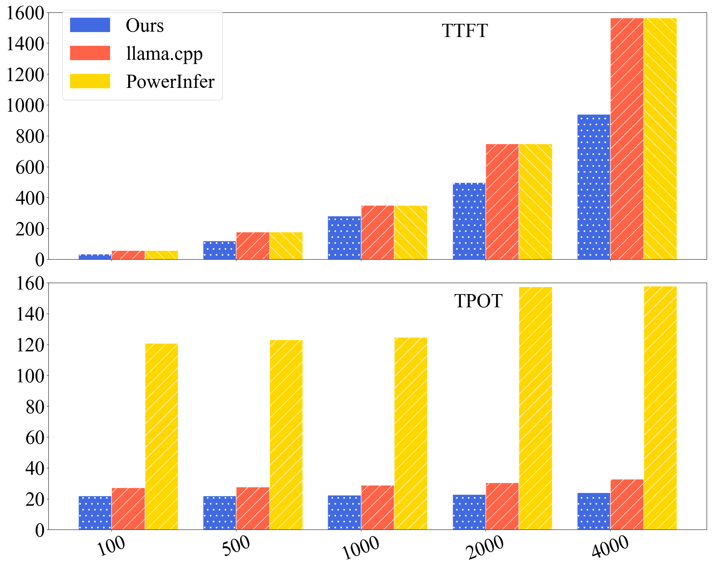
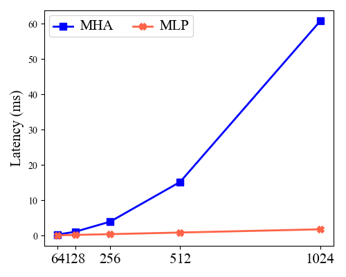
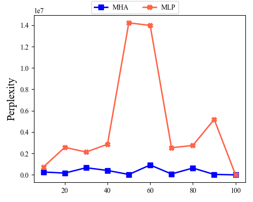
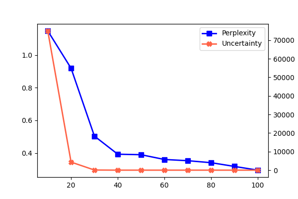

= Dynamic Elastic Multi-LoRA Model on-device Inference
Xihao Sun <sunxh2016@lzu.edu.cn>
:toc:
:icons: font
:url-quickref: https://docs.asciidoctor.org/asciidoc/latest/syntax-quick-reference/

== Problem Statement
Large language models have been extensively utilised in desktop application domains for tasks such as document processing and code generation. These models are predominantly deployed on cloud servers equipped with costly GPUs, which are susceptible to significant privacy security and network latency concerns. The advent of on-device LLM deployment as an emerging technology holds great promise in addressing these challenges and offers the potential for model customisation.

Nonetheless, the deployment of LLM on consumer GPUs poses a more pressing issue beyond the constraints imposed by strained memory. We observe that the desktop applications in question typically possess stringent requirements with regard to generation quality.

*#1 Different Quality of Experience (QoE) requirements between multiple applications*

In certain scenarios, users may require different levels of generation quality for different applications. For instance, a user may prefer a high-quality response to a question in a document summarization application, while a user may be more relaxed and prefer a fast response to a question in a chatbot application.

.QoE Requirements for Different Applications
|===
|Application                |TTFT    |TPOT     |Accuracy
|Grammar Checkingfootnote:[1]|<100ms  |100-200ms|90%
|Intelligent Assistantsfootnote:[1]|50-100ms|200-500ms|95%
|Intelligent Recommendationsfootnote:[1] |<500ms  |200-300ms|85%
|Code Auto-completionfootnote:[1] |1-2s    |<100ms   |85%
|Translationfootnote:[1] |1-2s    |<100ms   |90%
|Document Summarizationfootnote:[1] |2-5s    |<100ms   |85%
|===

.Tolerance thresholds for user wait timesfootnote:[https://www.nngroup.com/articles/response-times-3-important-limits/]footnote:[Hoxmeier, John A., and Chris DiCesare. "System response time and user satisfaction: An experimental study of browser-based applications." (2000).]
|===
|Latency                |Degree of tolerance
|0-2s|Ideal Range
|2-5s|Acceptable: Needs to be optimised
|5-10s|Critical risk: More than 50 percent of users may leave
|>10s|Unacceptable
|===

*#2 Different Quality of Experience Requirements for Individual Applications*

In certain urgent scenarios, users may prioritise inference speed over other considerations. To illustrate this point, we can consider a scenario within a smart office setting, where a user might need to generate a plan expeditiously and explicitly specify 'fast' or 'quickly' as the requisite requirement. However, existing model inference frameworks on the device frequently lack the capacity to dynamically adjust inference strategies according to such keywords, resulting in generation speed that falls short of user expectations and may even entirely disregard explicit requirements for speed.

== Existing Works
** *llama.cpp* The deployment of models with fixed quantitative accuracy is inadequate in responding to QoE.

** *Any-Precision* Multi-precision quantitative model deployment, which requires additional hardware resources, aims to satisfy the QoEs of different applications, but cannot respond to the fast claims of users in a single application.

** *PowerInfer* Exploit activation sparsity as a means of reducing computation. The objective of the project is the deployment of oversized models on the device and cannot respond to user rapid requests.

** *ELMS* The process of pruning the input prompt and cropping the model into multiple sub-models according to priority is undertaken with the objective of satisfying the latency claims of different applications, but cannot respond to the fast claims of users in a single application.

** *Ours* The identification of keywords in the prompt, the formulation of responses to the user's rapid claims, the adaptive selection of attention head weights, the reduction of computation, and the augmentation of inference speed are of paramount importance.

.Experimental comparisons

// * 要解决什么问题？
// * 为什么这个问题这么重要？
// * 有哪些数据可以说明现有的工作没有解决这个问题？
// * 必读文献 FlexGen Flextron ELMS TensorRT
// * LLMaaS / Single Model Multi-LoRA
//
// 低延迟场景到底差多少？
// 相同的量化模型：vLLM、llama.cpp、pytorch
// 128, 2k, 4K 推理延迟

== Observations
// 1. 对注意力层和多层感知机层的剪枝性能分析 *[Finished]*
// 2. 对每一层剪枝的分析
// 3. 对注意力层权重横向和纵向的分析

多模型 多prompt -> 对注意力层和多层感知机层的剪x`枝性能分析

// PCIE的版本
//
// 计算传输带宽是否达到模型峰值的瓶颈
//
// 卸载计算到CPU GPU
//
// 举例说明：
// 机器翻译应用
// 低精度模式，在实时对话翻译或低资源设备上，需要轻量级模型满足低延迟需求。
// 高精度模式，在文档级别的翻译需求中，需要高精度模型满足高质量翻译需求。

* The computational latency of MHA is longer than that of MLP, and random pruning MHA is less perplexing than MLP, with less performance loss

// 多个模型之间的性能差异，不同量化精度的模型性能差异
.Comparison of the Latency of MHA and MLP

.Comparison of the Perplexity of Pruning MHA and MLP

所以我们对MHA进行弹性层级的切分，加速模型的推理速度，同时尽可能减少模型性能的损失。

// TTFT主要受模型参数、prompt长度、batch size和硬件资源的影响。
* Batch Size的选择影响模型TTFT

.Comparison of the TTFT of Different Batch Size
image::Figure/batch-size.png[batch-size]

* 一致性代表模型推理性能

.Comparison of the Performance of Consistency and Non-Consistency

== Challenges

* 如何进行模型的切分减少精度损失

* 如何模型运行时监控推理精度

* 动态性的挑战：
** 用户诉求动态性：用户可能需要更快的响应时间，或者需要更高的精度。
** 资源动态性：8bit量化 7B模型，显存占用 大约在7G 左右，在一个12G的GPU上可以完成推理工作。但是当其他应用占用超过5G或者在模型加载完成时，剩余显存全被其他应用占用，现有的推理框架一般会显示模型加载失败或者OOM，无法执行推理工作。-> 意味着模型规模需要频繁切换 & 决策模块

GPU对应的显存大小：
https://en.wikipedia.org/wiki/List_of_Nvidia_graphics_processing_units

== Related Works

Exist works on device model deployment.

* Compression
** Quantization
** Pruning
** Knowledge Distillation

// 动态性问题描述
//
// 以上模型压缩方法均属于静态模型压缩，依旧无法针对资源的变化进行自适应的调整，必须等待资源空闲才能启动推理工作。
//
* Dynamic Quantizationfootnote:[Park, Yeonhong, Jake Hyun, SangLyul Cho, Bonggeun Sim, and Jae W. Lee. "Any-precision LLM: Low-cost deployment of multiple, different-sized LLMs." arXiv preprint arXiv:2402.10517 (2024).]
//
// Testbed: RTX 4070, RTX 4090, Jetson AGX Orin 64 GB
//
// .Memory Analysis of Any-precision LLM for Llama-2-7B.
// |===
// |Supported Bit-widths|Any-Precision LLM
// |{3,6}               |5.6 GB
// |{4,8}               |7.7 GB
// |{3,4,6}             |5.6 GB
// |{3,4,8}             |7.7 GB
// |{3,4,6,8}           |7.9 GB
// |{3,4,5,6,7,8}       |8.4 GB
// |===
//
// .Memory Analysis of DEML for Llama-2-7B INT8.
// |===
// |Elastic Level|Any-Precision LLM
// |1            |4.81 GB
// |...          |...
// |10           |6.67 GB
// |===
//
// Any-precision LLM对于Llama-2-7B的显存占用范围是[5.6 GB, 8.4 GB]，DEML对于Llama-2-7B的显存占用范围是[4.81 GB, 6.67 GB], 可以看出DEML的显存占用范围更小。
//
* Dynamic Pruning
//
// 由于ELMS没有开源代码，所以无法进行内存占用以及性能的实验对比。但是我们通过对比观察裁剪相同比例下的MHA和MLP的困惑度差异，发现裁剪后的MHA的困惑度更低，MLP的困惑度更高。而ELMS采用就是对MLP进行裁剪，DEML采用的是对MHA进行裁剪，将会减少模型性能的损失。
//
* Offloadingfootnote:[Chen, Shaoyuan, Yutong Lin, Mingxing Zhang, and Yongwei Wu. "Efficient and economic large language model inference with attention offloading." arXiv preprint arXiv:2405.01814 (2024).]footnote:[Song, Yixin, Zeyu Mi, Haotong Xie, and Haibo Chen. "Powerinfer: Fast large language model serving with a consumer-grade gpu." In Proceedings of the ACM SIGOPS 30th Symposium on Operating Systems Principles, pp. 590-606. 2024.]
//
// 全部卸载到CPU和全部在GPU的推理延迟对比
// 在Nvidia Quadro RTX 6000基于sequence length 512的ppl测试中，全部卸载到CPU的推理延迟是全部在GPU的推理延迟的20+倍。
//
// .Comparison of evaluation times
// |===
// |Device |TTFT       |TPOT   |PPL
// |Intel(R) Xeon(R) Gold 6230 CPU @2.10GHz|525.21ms|406.8ms| 3h36.88min
// |Nvidia Quadro RTX 6000    |24.18ms  |15.99ms|135442.82ms
// |===

== Design

* 模型切分

首先我们需要对模型进行切分，结合我们的观察一以及现有的GQA技术，我们将模型的MHA切分为多个层级，每个层级的权重数量大小是固定的，但是层级的数量是动态的，最小的粒度是注意力头的维度。

* 模型传输

其次我们需要对模型进行传输，将模型从CPU传输到GPU上参与推理，但是模型的传输需要考虑到模型的大小和设备的显存大小。

* 弹性微调

* 资源调度

== Experiments

=== Setup
* Hardware
** Nvidia Geforce RTX 3090
** Nvidia Geforce RTX 4090
** Nvidia Jetson AGX Orin 64 GB

* Software
** Llama-2-7B
** DeepSeek
** Qwen-7B

* Dataset
** Alpaca-en
** Wikitext-2

* Evaluation
** Perplexity
** Latency
** Memory Usage

=== Results
* Memory Analysis
* Performance Analysis
* Accuracy Analysis
* Resource Scheduling

== Conclusion

=== Existing Work
