= Design Process

== I. Load Model by Row icon:已完成[role="green", title="已完成"]

--split_mode, just support the load mode,value={row}

--tensor_split, model sparsity, value={0.1, 0.2, 0.3, ..., 1}

== II. Parallel Decoding icon:已完成[role="green", title="已完成"]

prefill phase: one batch

decode phase: share first token, two batches execute parallely

=== Memory: minimal alteration
.origin decode memory
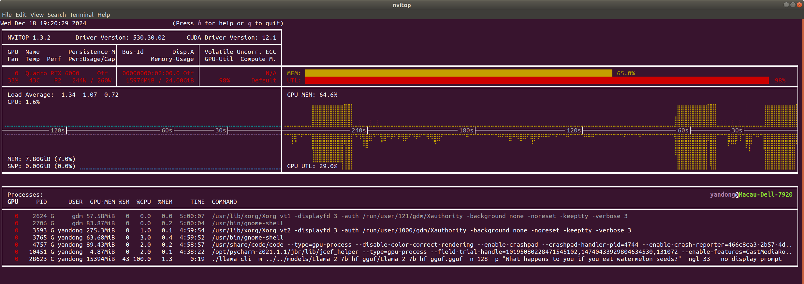

.origin max context memory
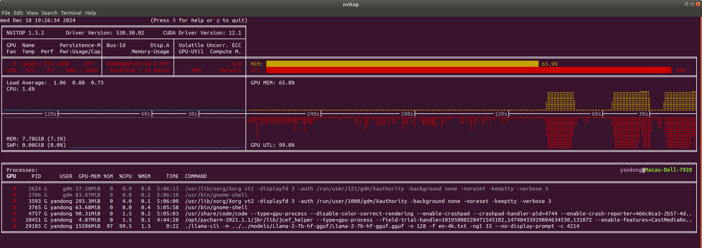

.parallel decode memory
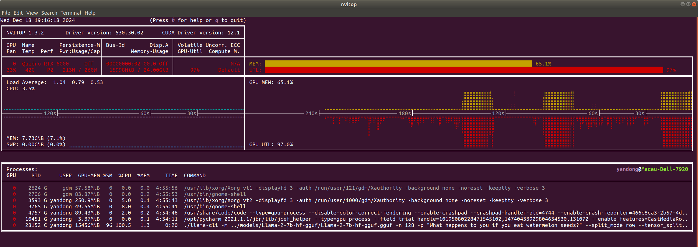

.parallel max ctx memory
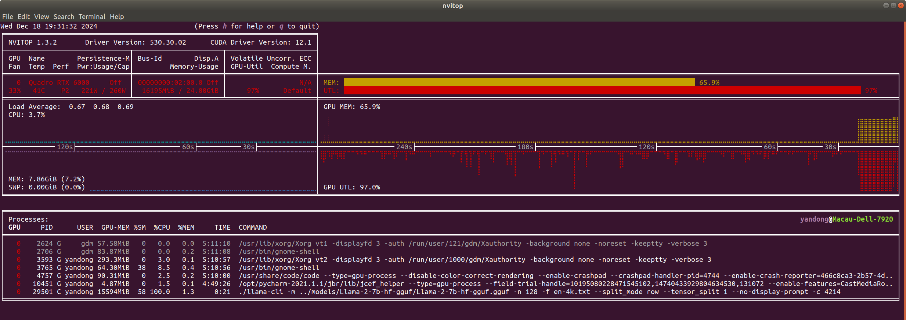

short token(15): 15998MiB - 15976MiB = 22MiB

max ctx token(4096): 16210MiB - 16197MiB = 13MiB

=== Latency: increase somewhat
same prefill latency

decode latency: slight increase of a few milliseconds

== III. Similarity Calculation icon:已完成[role="green", title="已完成"]

. Embedding Collection
. Cosine Similarity Calculation

== IV. Offline Model Modification
. Sparsity Analysis
. Weight resort icon:Processing[role="yellow", title="process"]
. Head level gradient fine-tuning: Parameter Freezing

    sparsity in {0.1, 0.2, 0.3, ..., 0.8, 0.9, 1}
    n_head = [head * sparsity]
    n_freeze_head = [head * (sparsity - 0.1)]
    finetuning_parameters = n_head - n_freeze_head

. Output new model

针对目标数据集进行指令微调

LLaMA-Factory

. 直接设置QKV的权重维度为512

    ValueError: Trying to set a tensor of shape torch.Size([4096, 4096]) in "weight" (which has shape torch.Size([512, 4096])), this looks incorrect.

. 新建模型QKV的权重维度为512，head数量为32，应该是4才能对应上2*272*4*128 = 278528

    RuntimeError: shape '[2, 272, 32, 128]' is invalid for input of size 278528

. 设置head数量为4，head_dim计算不是4096/32=128，变成4096/4=1024，维度错误

    RuntimeError: shape '[2, 96, 4, 1024]' is invalid for input of size 98304

Transformer LlamaAttention

LlamaConfig中新增自定义参数sparsity，用于选择训练权重

LlamaForCausalLM -> LlamaModel -> LlamaDecoderLayer -> LlamaAttention

使用LLaMA-Factory可以使用的数据集wiki/c4

LoFit 支撑了MHA的可解析性

image::LoFit.png[]

    选取部分主力头的注意力进行表征干扰，和微调不同的是不会对原始参数进行修改，是对计算完的注意力得分进行单独的偏移微调。

. 已完成训练过程通过掩码技术，加载部分head权重参与训练
. 已完成只针对self_attention的权重进行微调
. llama2-7B的微调和模型融合过程无法过度量化处理，使用24G GPU可能出现OOM
. LoRA微调依旧是全部hidden_dims 4096*4096更新，如果定义LoRA权重维度为4096*512的权重，训练完成的LoRA模型无法正常加载。
. 正在修改transformer的optimizer，只对指定位置的head相关的权重进行参数微调

15-01-2025

llama-2-7b-hf
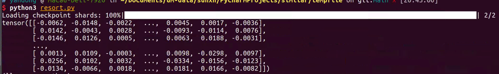
llama-2-7b-hf-P10 截取512列，也就是一个注意力头参与推理和训练
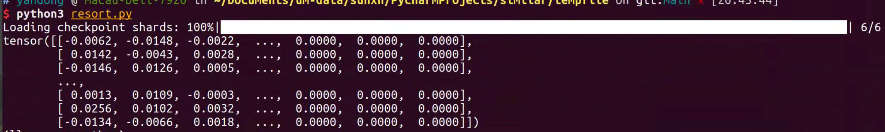
self-attn-lora-P10 将lora的512列之外的requires_grad设置为False
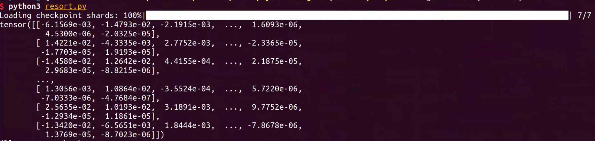
all-false-lora-P10 将lora的512列之外的requires_grad设置为False
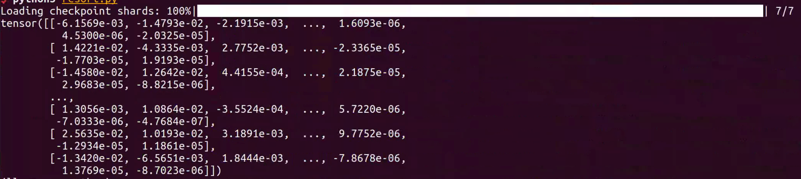
使用lora+自定义optimizer
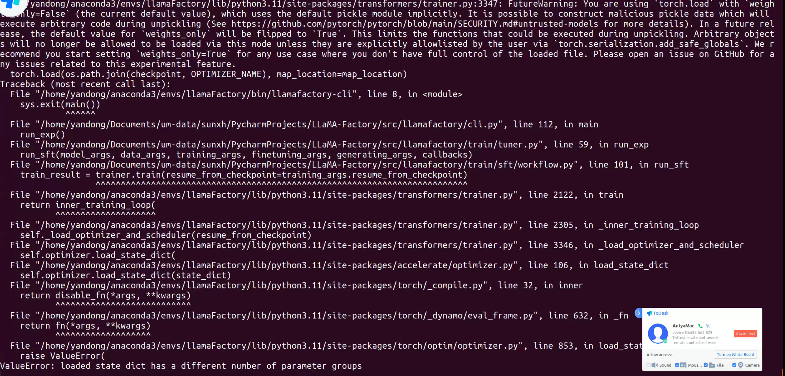

.Head Gradient LoRA Fine-Tuning 实现
1. 裁剪0.1稀疏性Self-Attn Head的模型进行模型训练，其他Head的参数全部设置为0，为了便于观察没有对其他参数权重进行更新。使用torch.save(),保存该模型用于微调
2. 自定义optimizer，对应Head只对目标Head对应的参数进行梯度更新。判断张量n列/n行到4096的参数全部为0，grad也对应设置为0，这里因为要冻结上一个head，所以前面的head级对应的列/行也要设置为0.
3. 等0.1微调完成，将与0.2的进行merge，然后参与微调。

修改前，可训练的参数: 19988480
对于添加适配的模型的除了self-attn之外的参数全部屏蔽，可训练率 0.2958%

修改后，可训练的参数: 8338608，可训练率 0.1241%

P10参数
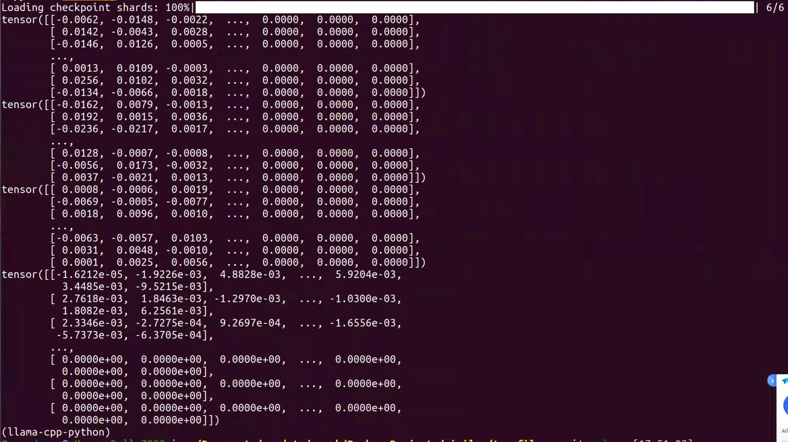

merge_lora1参数
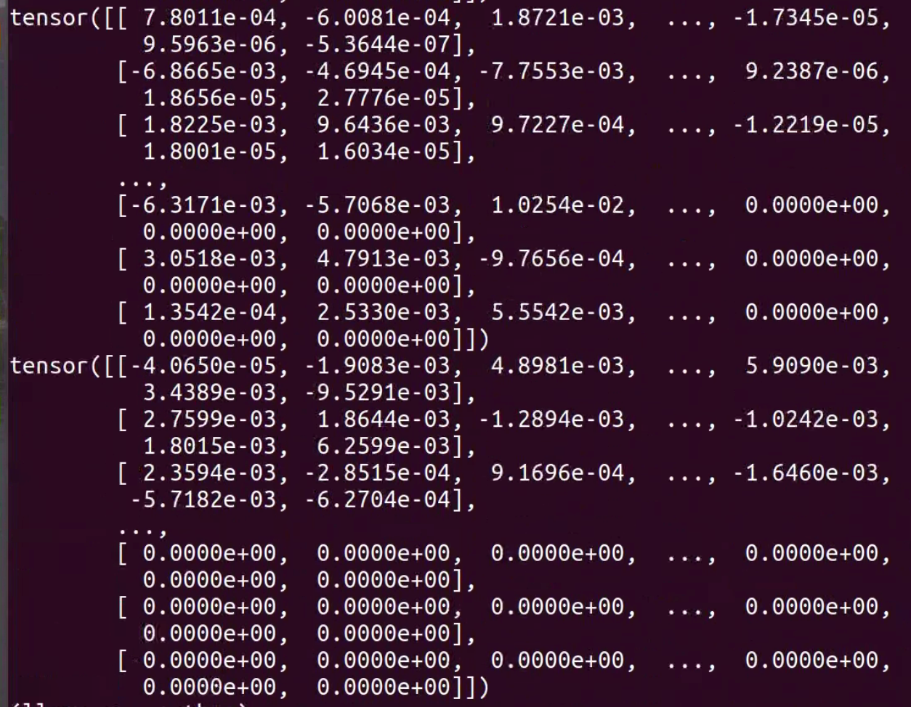

== V. RL scheduler
. Offline Training: Datasets with Latency and Accuracy
. Online Learning

关于多头注意力机制
https://juejin.cn/post/6844904078137360398

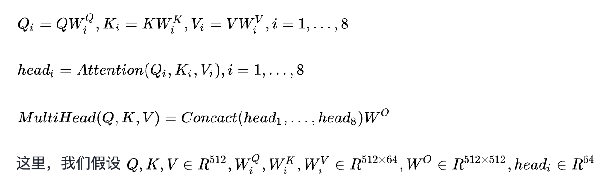

Q_i=QW_i^Q,K_i=KW_i^K,V_i=VW_i^V,i=1,...,8
head_i=Attention(Q_i,K_i,V_i),i=1,...,8
MultiHead(Q,K,V)=Concact(head_1,...,head_8)W^O
这里，我们假设 Q,K,V∈R^{512},W_i^Q,W_i^K,W_i^V∈R^{512\times64},W^O∈R^{512\times512},head_i∈R^{64}

RL使用最简单的

baseline：
.llamacpp
.PowerInfer

.ELMS

推理速度提升
