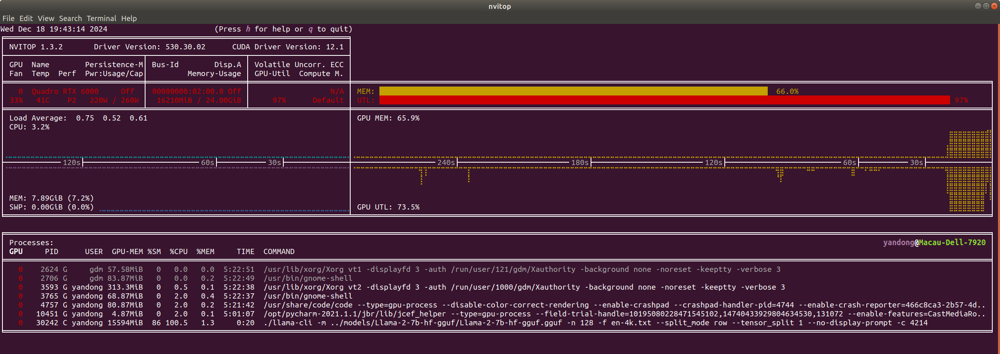

= Design Process

== I. Load Model by Row icon:已完成[role="green", title="已完成"]

--split_mode, just support the load mode,value={row}

--tensor_split, model sparsity, value={0.1, 0.2, 0.3, ..., 1}

== II. Parallel Decoding icon:已完成[role="green", title="已完成"]

prefill phase: one batch

decode phase: share first token, two batches execute parallely

=== Memory: minimal alteration
.origin decode memory

.origin max context memory

.parallel decode memory

.parallel max ctx memory

short token(15): 15998MiB - 15976MiB = 22MiB

max ctx token(4096): 16210MiB - 16197MiB = 13MiB

=== Latency: increase somewhat
same prefill latency

decode latency: slight increase of a few milliseconds

== III. Similarity Calculation icon:已完成[role="green", title="已完成"]

. Embedding Collection
. Cosine Similarity Calculation

== IV. Offline Model Modification
. Sparsity Analysis
. Weight resort icon:Processing[role="yellow", title="process"]
. Head level gradient fine-tuning: Parameter Freezing

    sparsity in {0.1, 0.2, 0.3, ..., 0.8, 0.9, 1}
    n_head = [head * sparsity]
    n_freeze_head = [head * (sparsity - 0.1)]
    finetuning_parameters = n_head - n_freeze_head

. Output new model

针对目标数据集进行指令微调

LLaMA-Factory

. pretrain dataset json

== V. RL scheduler
. Offline Training: Datasets with Latency and Accuracy
. Online Learning

关于多头注意力机制
https://juejin.cn/post/6844904078137360398

Q_i=QW_i^Q,K_i=KW_i^K,V_i=VW_i^V,i=1,...,8
head_i=Attention(Q_i,K_i,V_i),i=1,...,8
MultiHead(Q,K,V)=Concact(head_1,...,head_8)W^O
这里，我们假设 Q,K,V∈R^{512},W_i^Q,W_i^K,W_i^V∈R^{512\times64},W^O∈R^{512\times512},head_i∈R^{64}

RL使用最简单的