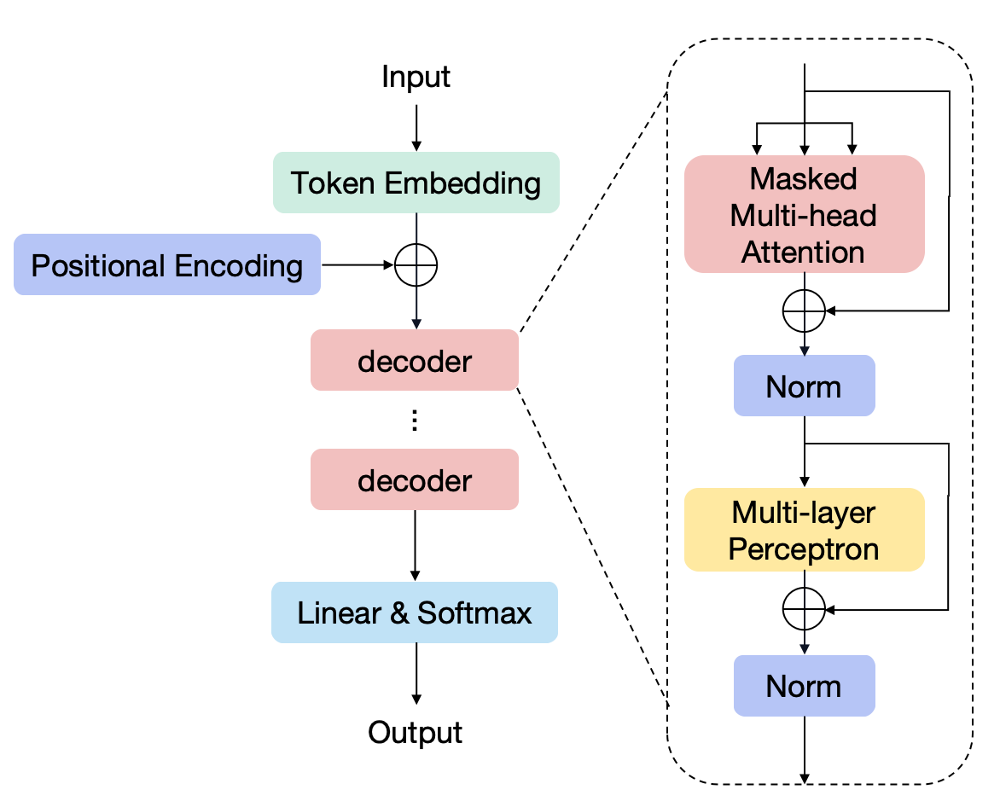
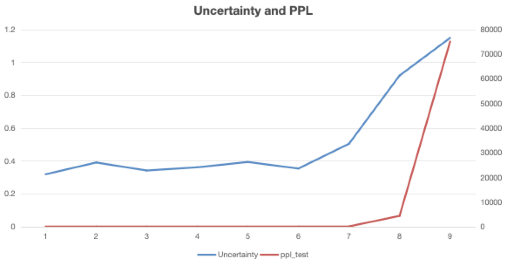
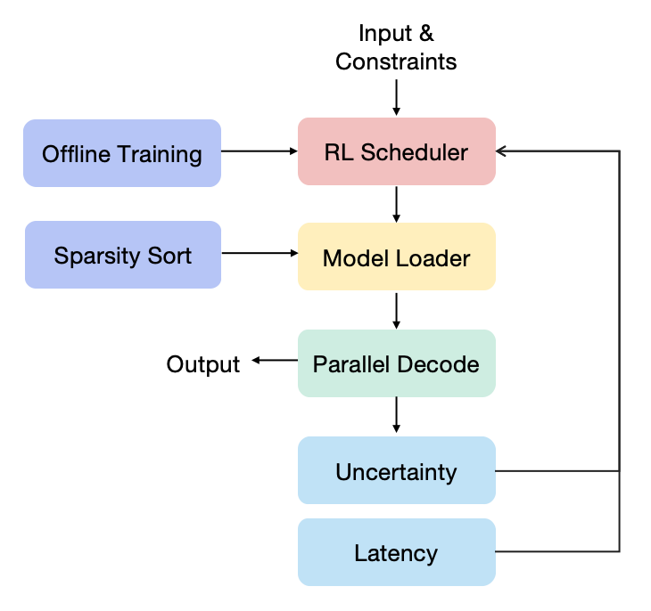
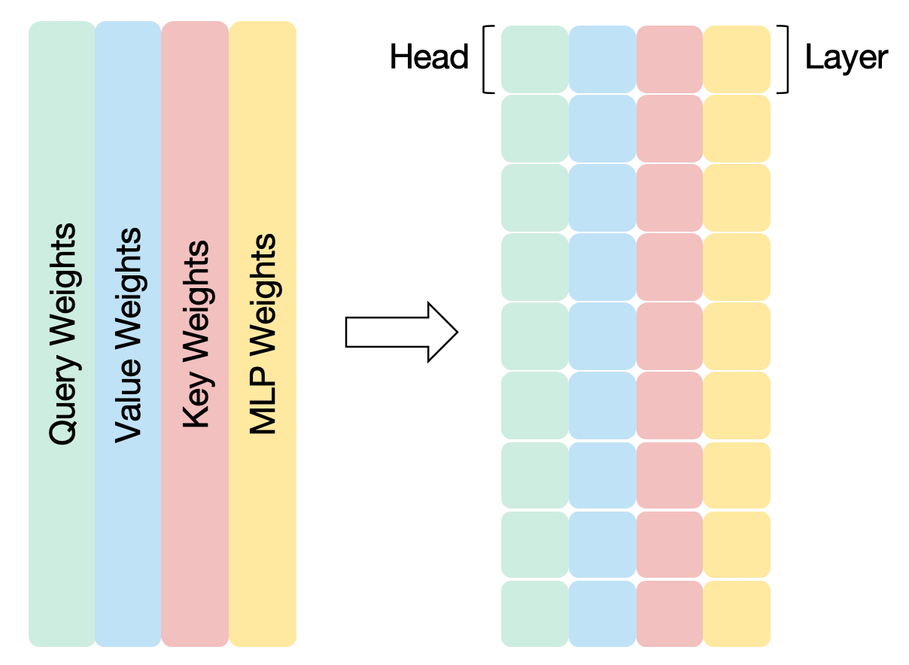
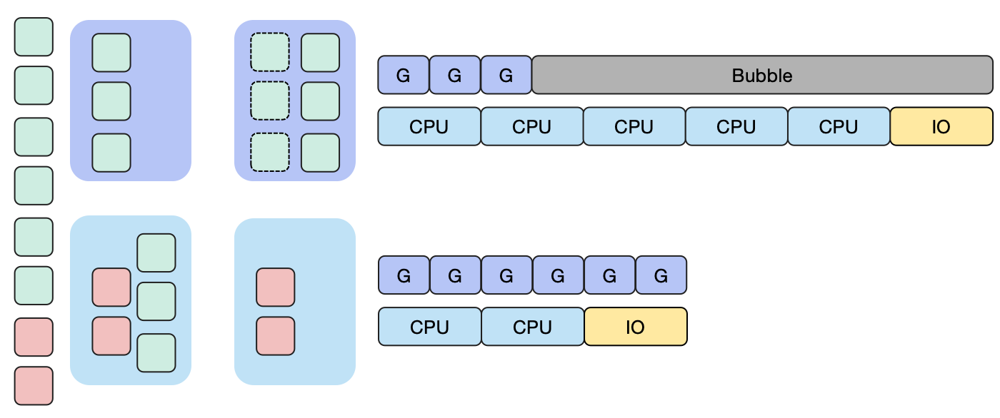

= Article

== Abstract

== 1 Introduction

Contribution

- 我们解决了弹性模型无法根据推理性能和延迟诉求调整模型规模的问题，识别了运行时评估模型性能和弹性模型规模频繁切换的挑战。

- 并行解码实现两组输出之间的不确定性计算，在不增加计算耗时的情况下，完成模型运行时的推理精度衡量；

- 转置模型权重加载，实现弹性模型规模的快速切换

- GPU内存不足的场景下，使用多头并行流水线充分利用CPU和GPU的计算资源，提高推理效率

== 2 Background and Motivations

=== 2.1 生成式大语言模型基础

*Decoder-only Architecture*

.figure Transformer Architecture

介绍目前主流的解码器结构

- MHA & MLP

为后面稀疏性处理奠定背景

- Prefill & Decode

提出推理延迟的指标TTFT&TPOT

参考文献【Attention is all you need】

*Model Sparsity*

介绍模型稀疏性压缩，采用部分MHA和MLP也可以达到一定精度

参考文献【SparseGPT、Wanda】

=== 2.2 LLM as Service
*LLM as Service.*

- 模型作为系统服务支持其他应用，不同的应用之间的用户诉求不同，即推理延迟和精度要求是各式各样的。

=== 2.4 Opportunities and Challenges

在边缘设备上部署具有弹性的模型显示出巨大的潜力，但根据用户对模型性能的具体需求设计一个灵活的模型调整机制，仍然是一个亟待解决的挑战。

TIP: Why need？Why difficult？

*Challenges:*

TIP: 挑战一：运行时模型性能评估

说明为什么要在运行时评估模型性能，为什么现有的方法都没有实现？

- 精度诉求对于LLM服务的重要性

在用户的角度来看，模型的性能是至关重要的。大型语言模型的性能优劣直接决定了用户的使用体验。若模型的准确性无法满足用户的期望，用户可能会选择放弃该模型，转而寻求准确性更高的模型。特别是在商业和金融领域，这些领域高度依赖模型来进行决策footnote:[]，模型的准确性对决策质量有着决定性的影响，进而直接关系到经济效益。

- 现有对于模型精度评估的方法

尽管目前存在多种模型性能评估方法，基于基准测试的大语言模型评估框架footnote:[]，基于人类提问的评估框架footnote:[]，基于模型的评估框架footnote:[]，但这些方法普遍依赖于外部数据集。当用户输入的文本内容超出了这些数据集的范畴时，现有方法便无法有效地对模型输出的准确性进行评估。因此，探索不依赖外部数据集的评估方法显得尤为重要。在这一领域，不确定性评估方法作为一种替代方案，已显示出其潜力。当前，基于多轮采样的不确定性评估技术footnote:[]处于领先地位，该方法不仅能够捕捉到丰富的语义信息，而且能够在不依赖外部数据集的情况下，对模型的性能进行准确评估。

- 端侧模型精度评估的困难性

然而，受限于边缘设备上的内存和计算资源，端侧模型在推理过程中难以实现并行化的多轮推理任务。若采用串行方式执行端到端的多轮推理，将不可避免地导致推理延迟显著增加。在不依赖外部数据集的前提下，对端侧模型的性能进行准确评估，无疑构成了一个严峻的挑战。

TIP: 挑战二：模型规模频繁切换

- 为什么会频繁的进行模型规模的切换

用户在不同领域应用中对大型模型的性能需求存在显著差异。针对这一现象，我们的设计方案能够根据用户的特定需求，对模型规模进行动态调整。然而，当用户在两个或多个应用间频繁切换时，模型规模的快速变化可能导致频繁的内存访问需求，进而引发显著的内存访问开销。

- 现有的方法有哪些？

对于Transformer架构的模型，通用的模型加载方法就是按Transformer block层加载footnote:[]，如果需要卸载运算只需要指定层数到CPU和GPU进行运算。针对GPU集群场景还存在一种模型加载方法，先将模型按层加载进内存，然后层内张量按行分割模型到多个GPU中参与运算footnote:[]，最后由主GPU完成汇聚运算。

- 为什么他们没有解决？

以上两种方法在每次模型切换都需要进行空间释放，重新加载模型，当模型规模频繁切换时将无法避免模型加载带来延迟。尤其是在单GPU的端侧设备上，数据从主存到GPU显存的传输开销将会更大，减少模型规模切换的延迟将是一个挑战。

*Observation:*

NOTE: 说明为什么要有这个观察，每个观察都必须包含图表数据

观察1: 模型输出的不确定性表明模型的运行性能。

    为解决运行时模型精度评估的挑战，我们采用模型多组输出结果计算模型的不确定性。我们观察到不同稀疏性的模型表现的不确定性变化趋势同PPL的变化趋势相同。

    数据：不同稀疏性之间的不确定性和PPL的变化趋势相近

.Uncertainty & PPL

观察2：消费级GPU上在解码可以并行执行两个批次

    为什么要在解码阶段进行并行处理？
    1. 并行批次可以在相同的时间段输出两个不同的输出
    2. 服务器上多批次证明存在计算资源空闲
    参考文献【DistServe】

    证明端上同时存在计算资源空闲
    数据：在NVIDIA GeForce RTX 4090 GPU 24G的显卡上并行运行的内存占用以及计算资源占用

.Memory Occupy

观察3: 模型参数可以按行加载到消费级GPU中

    为什么要按行加载？
    参考文献【】

    数据：按行增量加载的模型加载时间和按层加载的模型加载时间对比

*Opportunities:*

基于以上观察，我们可以利用强化学习实时选择弹性模型的大小，利用模型运行时的并行解码双输出之间的一致性计算进行兼容延迟和精度的动态调整策略。

== 3 Design

=== 3.1 Overview
.Structure

=== 3.2 SLO-oriented reinforcement learning

为什么要这么设计？之前的设计有哪些？有哪些缺陷？困难点是什么？

1. 训练数据不具有通用性

2. 不能够根据事实数据进行策略调整

=== 3.3 Model tensor transpose loading

为什么要这么设计？之前的设计有哪些？有哪些缺陷？困难点是什么？

不需要重新加载全部的层，减少内存占用，实现增量变化。

.Load Model by Row

=== 3.4 Multiple Groups Pipeline

为什么要这么设计？之前的设计有哪些？有哪些缺陷？困难点是什么？

GPU内存较小，无法加载全部模型参数时

.Multi-group Pipline

== 4 Implementation and Setup

== 5 Evaluation

== 6 Related Work

TIP: 这部分写出彩可以放在第二章，说明现有相关研究工作的不足之处。
Existing Inference Framework on device

== 7 Conclusions

== References

LLM Inference Serving: Survey of Recent Advances and Opportunities

dLoRA: Dynamically Orchestrating Requests and Adapters for LoRA LLM Serving

DistServe: Disaggregating Prefill and Decoding for Goodput-optimized Large Language Model Serving

Look Before You Leap- An Exploratory Study of Uncertainty Measurement for Large Language Models

SELFCHECKGPT：Zero-Resource Black-Box Hallucination Detection for Generative Large Language Models

Design
设计她的目的是什么？
设计的时候面临的挑战是？
为什么简单的方式不行？
现有的工作为啥不行？直观的想法为什么不行？
将我们的设计

怎么可以吧并行解码做的更好更细
并行解码带来的额外开销？KV Cache增加，计算量增加 —— 引入的额外的overhead
层级性的设计：TODO 相同的tokenID KV复用？

传统的剪枝、量化的精度
离线处理才行

之前加载方式的缺陷
我的加载的好在哪？精髓
关于模型加载有没有更好的点层级设计
作为第二层的设计